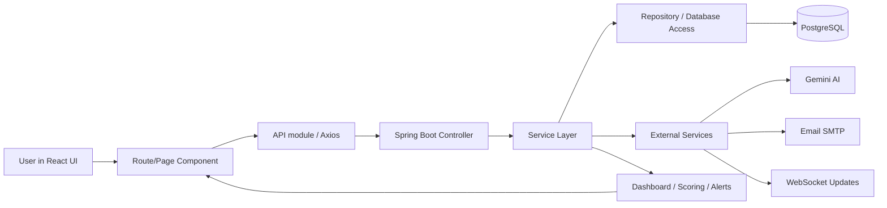

# Pockettrack Features and Architecture

## Overview
Pockettrack is a full-stack personal finance platform built with Spring Boot on the backend and React + Vite on the frontend. It focuses on account tracking, transaction management, budgeting, savings goals, AI receipt scanning, recurring transaction detection, financial health scoring, and event-based shared expense management.

## Core Features
- JWT-based authentication with register/login flows
- Multiple account support with balance management
- Full transaction CRUD with balance correction logic
- Budget creation, tracking, rollover, and alerting
- Savings goals with contribution tracking and completion handling
- AI receipt scanning using Gemini to prefill transaction details
- CSV and spreadsheet-style transaction import
- Recurring transaction detection and anomaly tracking
- Financial health score calculations and dashboard summaries
- Monthly email reports and subscription-style alerts
- WebSocket-powered real-time or near-real-time UI updates
- Shared expense and event settlement features
- Redis caching for high-performance data retrieval
- Distributed API rate-limiting via Bucket4j
- Dark/light theme support across the frontend

## Backend Architecture
The backend is organized by domain packages under `com.pockettrack.backend`.

- `auth` handles JWT creation, validation, and authentication filters.
- `account` manages accounts, account analytics, and balance updates.
- `transaction` owns transaction CRUD, import, and related business rules.
- `budget` handles budgets, budget badges, alerts, and rollover logic.
- `goal` handles savings goals and progress tracking.
- `event` manages shared events, expenses, splits, and settlements.
- `ai` integrates Gemini-based parsing and chat features.
- `dashboard` computes predictive insights and subscription anomaly data.
- `common` contains cross-cutting services such as security config, dashboard endpoints, health score, email delivery, recurring detection, and monthly reporting.
- `config` contains application wiring such as WebSocket configuration.
- `user` stores the user entity and repository.

## Frontend Architecture
The frontend is a React SPA structured around pages and reusable UI.

- `pages/` contains route-level screens such as Dashboard, Accounts, Transactions, Budget, Goals, Health Score, Receipt Scanner, Import, Recurring, Events, Settlement, Login, Register, and Landing.
- `components/layout/` contains the shared application shell.
- `components/ui/` contains reusable widgets such as AI chat, safe-to-spend, subscription alerts, and dashboard badges.
- `api/` contains Axios-based modules for backend communication.
- `context/` contains auth and theme state.
- `hooks/` contains WebSocket client logic.

## End-to-End Flow Architecture

## Typical Request Flow
1. The user interacts with a page in the React app.
2. The page calls the matching API module through Axios.
3. The backend controller validates the request and forwards it to the service layer.
4. The service layer applies business logic and uses repositories to read or write PostgreSQL data.
5. Specialized services integrate with Gemini, email, or WebSockets when needed.
6. The backend returns a response that updates the UI state and dashboard widgets.

## Key Interaction Paths
- Authentication: login/register page -> auth API -> JWT filter/security config -> protected backend routes.
- Transactions: transaction page -> transaction API -> transaction service -> account balance updates -> dashboard refresh.
- Budgeting: budget page -> budget API -> budget service -> alert/rollover logic -> dashboard widgets.
- AI scanning: receipt scanner page -> upload request -> Gemini service -> parsed transaction draft -> save transaction.
- Events: events dashboard -> event API -> expense and settlement services -> shared balances and settlement state.

## Data And Integration Layer
- PostgreSQL stores persistent financial, budget, goal, and user data.
- Redis acts as a high-performance caching layer and distributed rate-limiting backend.
- Bucket4j provides token-bucket rate limiting for expensive AI endpoints.
- JWT provides stateless authentication.
- Gemini powers receipt extraction and chat assistance.
- SMTP is used for monthly email reports and alerts.
- WebSockets support live UI updates where the app needs them.
- Docker Compose handles orchestration of the database, cache, backend, and frontend.

## Frontend To Backend Summary
The frontend is responsible for presentation, routing, and client-side state. The backend is responsible for business rules, persistence, auth, scheduled jobs, integrations, and financial calculations. The app is therefore split into a thin presentation layer and a service-heavy domain layer.
